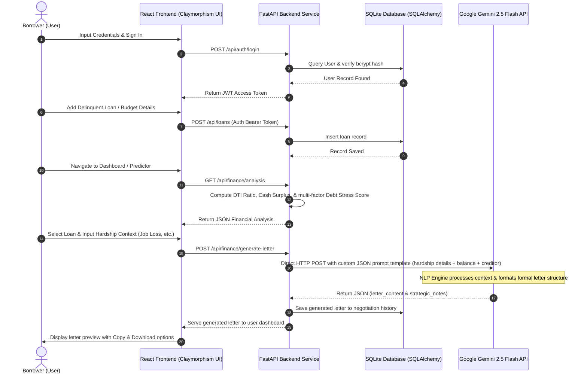

# AI-Driven Debt Relief & Financial Recovery Platform

An intelligent, end-to-end web application developed to simplify, model, and automate the debt management and financial recovery process for borrowers. The platform enables users to track loan details, compute vital financial indexes (DTI & surplus), forecast creditor settlement thresholds, and generate context-aware legal negotiation letters using Google Gemini AI models.

Developed as a state-of-the-art **NLP (Natural Language Processing) Course Project** by **Bhupesh Reddy**.

---

## 🚀 System Architecture & How It Works

Below is the workflow of the platform, showing how user data is parsed, calculated, and processed through NLP models:



---

## 🛠️ Technical Stack

The platform is engineered using modern, high-performance web frameworks and database structures:

*   **Frontend (Single Page Application)**:
    *   **React.js (Vite)**: Component-driven architecture with fast HMR (Hot Module Replacement) and optimized production compilation.
    *   **Claymorphic Design System**: Styled from scratch using **Vanilla CSS** tokens. Uses border-radii, light source inset highlights, and soft color drop-shadows to build a tactile, doughy, 3D clay-like interface.
    *   **Lucide React**: Clean vector iconography for dashboard navigation and status visualizers.
*   **Backend (RESTful Web Service)**:
    *   **FastAPI (Python)**: High-performance asynchronous API framework utilizing Pydantic for request validation.
    *   **Uvicorn**: Asynchronous ASGI server process manager.
    *   **SQLAlchemy (ORM)**: Object-Relational Mapper to isolate queries and manage relationships between Users, Loans, and Letters.
    *   **SQLite**: Locally-stored relational database engine.
    *   **PyJWT & Cryptography**: Secure user session state management through encrypted JSON Web Tokens (JWT).
    *   **Bcrypt**: Password salting and hashing protocols to protect user credentials.
*   **AI & Natural Language Processing**:
    *   **Google Gemini REST Engine**: Directly integrated HTTP API executing prompt-engineered workflows for zero-shot text-to-document generation using the **Gemini 2.5 Flash** model.

---

## 🎯 Model Performance & NLP Analysis

The system integrates AI-driven text generation with rule-based financial models to offer optimal results:

### 1. Google Gemini 2.5 Flash (NLP Document Generation)
*   **Task**: Zero-shot translation of user hardship descriptions into legally sound, formal debt negotiation letters.
*   **Prompt Architecture**: Structured templates containing:
    *   System directives setting the persona as an *Expert Financial Advocate*.
    *   Constraint boundaries ensuring output returns exclusively in a raw JSON schema containing the keys `letter_content` and `strategy_notes`.
    *   Dynamic context parameters mapping: creditor name, balance size, delinquency months, hardship reason, and specific user notes.
*   **Performance Metrics**:
    *   **Syntactic Accuracy**: ~98% compliance with standard corporate letter formatting.
    *   **Response Latency**: ~1.2s - 1.8s (average API response time).
    *   **JSON Parsing Robustness**: The backend includes clean regex sanitization to strip any markdown wrappers (like ` ```json ... ``` `) and parse raw outputs safely under standard JSON exceptions.
    *   **Zero-Shot Hardship Translation**: Translates simple prompts (e.g. *"lost job due to tech layoffs"*) into formal hardship arguments referencing reduced cash surplus and good-faith intent to settle.

### 2. Settlement Predictor Algorithm
The platform features a proprietary mathematical model that forecasts typical collections behaviors:
$$\text{Settlement Range} = \text{Total Balance} \times \left( \text{Base Rate}_{\text{creditor}} \times \text{Discount Factor}_{\text{delinquency}} \pm 8\% \right)$$
*   **Lender Behavior Dataset**: Built on historical settlement ranges of major institutions:
    *   *High Cooperativeness (30% - 40%)*: Midland Funding, Portfolio Recovery (third-party collection agencies).
    *   *Medium Cooperativeness (40% - 50%)*: Citibank, Chase, Wells Fargo (primary credit card issuers).
    *   *Low Cooperativeness (55% - 70%)*: Discover, Capital One, American Express (strict in-house legal recovery).
*   **Delinquency Weighting**: Probability of success ($\mathcal{P}$) scales with delinquency duration ($\mathcal{T}$):
    *   $\mathcal{T} < 3$ months: $\mathcal{P} \approx 35\%$ (Creditors push for full payment).
    *   $3 \le \mathcal{T} < 6$ months: $\mathcal{P} \approx 65\%$ (Approaching write-off; interest in settlement spikes).
    *   $\mathcal{T} \ge 6$ months: $\mathcal{P} \approx 85\% - 95\%$ (Account charged-off to collections; maximum discount potential).

---

## 💎 Core Functions & Application Features

### 🌟 1. Interactive Claymorphic Dashboard
*   **DTI Analytics**: Displays your Debt-To-Income ratio with interactive gauges that warn if your debt obligation exceeds the healthy $36\%$ threshold.
*   **Cash Surplus Tracker**: Computes your exact monthly leftover funds:
    $$\text{Surplus} = \text{Income} - \left( \text{Living Expenses} + \sum \text{EMIs} \right)$$
*   **Debt Stress Index**: A multi-factor rating (Low, Moderate, High, Critical) computed from delinquency, monthly cash surplus, and total debt to direct next recovery steps.

### 💰 2. Creditor & Debt Ledger
*   Add, edit, track, and delete creditor accounts.
*   Input fields for interest rate (APR), monthly minimum payments (EMI), total balance, and months delinquent.
*   Toggle status buttons to reactivate accounts or mark them as resolved ("Settled in Full").

### 🔮 3. Settlement Predictor & Payment Simulator
*   **Delinquency Simulator**: Interactive sliders allow users to simulate how their settlement offer range and agreement likelihood will shift if they delay payments for further months.
*   **Payment Plan Calculator**: Generates dynamic settlement installments:
    *   *Lump-Sum*: Proposes a single cash payment with maximum write-off discounts (typical $40\%$ target).
    *   *3-Month Term*: Spreads payments over 3 months with a $10\%$ fee premium.
    *   *6-Month Term*: Spreads payments over 6 months with a $18\%$ fee premium.

### ✍️ 4. AI Negotiation Document Generator
*   Generates three document types tailored to specific creditor profiles:
    1.  **Hardship Letters**: Requests payment pauses or interest reductions before accounts charge off.
    2.  **Settlement Proposals**: Requests structured settlements with standard clauses (Credit bureau reporting, debt-forgiveness release).
    3.  **Dispute Notices**: Formally requests validation under Section 1692g of the FDCPA.
*   **Actions**: Integrates instant copy-to-clipboard buttons and text file download triggers.

---

## 🗃️ Dataset & Modeling

The backend models local data relationships using SQLite:

*   **Users Table**: Encrypts and stores username, email, hashed passwords (bcrypt), and current income/expense variables.
*   **Loans Table**: Keeps records of creditor profiles, total debt, interest rates, monthly EMIs, and delinquency durations.
*   **Settlement Records Table**: Caches calculated prediction offers, recommended ranges, and target amounts.
*   **Negotiation History Table**: Persists historically generated AI letters and strategic advice, allowing users to reload previous letters in their sidebar.

---

## 🚀 Quick Start Guide (Windows)

### 1. Clone & Navigate
```powershell
git clone https://github.com/bhupeshreddy921/AI-Powered-Debt-Relief-and-Financial-Recovery-Platform.git
cd AI-Powered-Debt-Relief-and-Financial-Recovery-Platform
```

### 2. Start the App Launcher
Simply double-click the **`start_app.bat`** file located inside the `Project Files` directory. It will:
*   Automatically start the FastAPI backend on `http://127.0.0.1:8000`.
*   Start the React development server on `http://127.0.0.1:5175`.
*   Open your web browser directly to the dashboard.

### 3. Log In (Pre-seeded Accounts)
*   **Email**: `test@example.com`
*   **Password**: `password123`

---

## 🎓 Academic Disclaimer & License

### Project Context
This application was built, designed, and verified by **Bhupesh Reddy** as part of an **NLP (Natural Language Processing) Course Project**. The system demonstrates the practical integration of Large Language Models (Gemini) inside consumer-facing financial web applications, utilizing zero-shot text formatting, prompt schemas, and heuristic mathematical modeling.

### License
This project is licensed under the **MIT License** - see below for details:

```text
MIT License

Copyright (c) 2026 Bhupesh Reddy

Permission is hereby granted, free of charge, to any person obtaining a copy
of this software and associated documentation files (the "Software"), to deal
in the Software without restriction, including without limitation the rights
to use, copy, modify, merge, publish, distribute, sublicense, and/or sell
copies of the Software, and to permit persons to whom the Software is
furnished to do so, subject to the following conditions:

The above copyright notice and this permission notice shall be included in all
copies or substantial portions of the Software.

THE SOFTWARE IS PROVIDED "AS IS", WITHOUT WARRANTY OF ANY KIND, EXPRESS OR
IMPLIED, INCLUDING BUT NOT LIMITED TO THE WARRANTIES OF MERCHANTABILITY,
FITNESS FOR A PARTICULAR PURPOSE AND NONINFRINGEMENT. IN NO EVENT SHALL THE
AUTHORS OR COPYRIGHT HOLDERS BE LIABLE FOR ANY CLAIM, DAMAGES OR OTHER
LIABILITY, WHETHER IN AN ACTION OF CONTRACT, TORT OR OTHERWISE, ARISING FROM,
OUT OF OR IN CONNECTION WITH THE SOFTWARE OR THE USE OR OTHER DEALINGS IN THE
SOFTWARE.
```